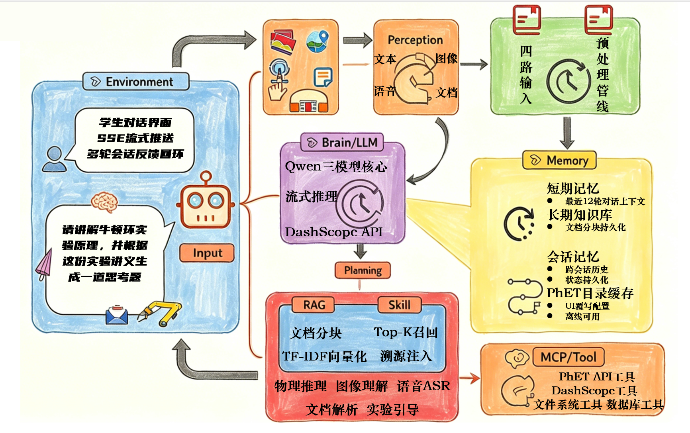

# 项目模块说明文档

## 1. 项目概述

本项目是一个面向物理实验教学场景的多模态智能体系统，目标是在同一套应用中同时支持以下能力：

- 物理实验相关的文本问答与启发式教学
- 文档、图片、音频等多模态输入
- 基于上传资料与内置知识库的 RAG 检索增强
- 课内实验与 PhET 仿真资源的统一接入
- Web、PWA 与 Android APK 的多端运行

从系统结构上看，本项目并不是单一的“聊天网页”，而是由前端交互层、后端业务层、模型调用层、知识增强层、数据持久化层、仿真资源层以及移动端封装层共同组成的复合型应用。

为便于理解，本文将整个项目划分为 **8 个核心模块**。

---

## 2. 总体架构

```text
用户
  │
  ├─ 浏览器 / PWA / Android App
  │        │
  │        ├─ 前端界面层（index.html / style.css）
  │        ├─ 前端逻辑层（app.js）
  │        ├─ 轻后端层（lite-backend.js，可选）
  │        ├─ PWA/移动配置层（mobile-config.js / sw.js / manifest）
  │        └─ Android 壳层（static/capacitor-shell）
  │
  └─ FastAPI 后端
           │
           ├─ API 网关与业务编排（backend/main.py）
           ├─ 模型调用网关（backend/models.py）
           ├─ RAG 文档处理（backend/rag.py）
           ├─ 数据持久化（backend/storage.py）
           └─ 仿真目录与教学画像（backend/phet_catalog.py / backend/phet_ui_overrides.py）
```

这个架构的核心特点是：

- 前端负责“交互、展示、状态切换与仿真界面控制”
- 后端负责“路由、业务编排、存储、知识增强与模型请求组织”
- 模型层负责“把统一的教学请求转发到 DashScope 系列模型”
- 移动端层负责“把网页应用封装成可安装、可打包的 Android 应用”

---

## 3. 模块划分

### 模块一：前端页面结构模块

**核心文件**

- `static/index.html`

**主要作用**

- 定义整个单页应用（SPA）的页面骨架
- 承载聊天区、上传区、实验库、仿真弹窗、数据作图弹窗、网页拍照弹窗等 DOM 结构
- 为前端逻辑脚本提供稳定的元素挂载点

**在系统中的位置**

- 它是用户直接看到的“页面结构层”
- 本身不负责复杂业务，只负责把前端需要操作的区域组织起来

**与其他模块的关系**

- 被 `static/app.js` 读取和驱动
- 被 `static/style.css` 赋予视觉样式
- 通过按钮、表单、弹窗等结构与后端业务流程建立入口

---

### 模块二：前端交互与业务编排模块

**核心文件**

- `static/app.js`

**主要作用**

- 管理前端全局状态，如会话、上传文件、待发送图片、待发送音频、实验参数、弹窗开关等
- 负责聊天消息的发送、SSE 流式接收与消息渲染
- 负责上传文件、拍照、录音、相册导入、网页拍照等多模态入口
- 负责课内实验仿真、PhET 工作区、实验数据作图、项目/会话树等核心交互
- 在 Web、PWA、Android 壳层、本地轻后端之间做运行环境适配

**在系统中的位置**

- 它是整个前端的“控制中枢”
- 从工程角度看，`app.js` 相当于把 UI、状态机、网络请求和实验交互集中编排在一个主控脚本中

**与其他模块的关系**

- 向下操作 `index.html` 中的所有界面元素
- 向后调用 FastAPI 后端接口
- 在移动轻后端模式下，会把请求转给 `lite-backend.js`
- 读取 `mobile-config.js` 的运行时配置
- 配合 `sw.js` 处理离线缓存和资源更新

---

### 模块三：前端样式与视觉呈现模块

**核心文件**

- `static/style.css`

**主要作用**

- 定义全站视觉风格，包括毛玻璃面板、聊天气泡、弹窗、实验面板、图表区域、移动端布局等
- 提供响应式布局，使系统可同时运行在桌面端、手机浏览器和 Android App 壳层中
- 负责交互反馈样式，如按钮悬停、录音状态、相机菜单、曲线保存按钮、实验面板排版等

**在系统中的位置**

- 它是系统的“表现层”
- 不直接承担业务逻辑，但会明显影响用户可用性和实验操作体验

**与其他模块的关系**

- 与 `index.html` 一起构成前端静态界面基础
- 通过 class/id 与 `app.js` 联动，实现显隐控制、状态切换和组件样式反馈

---

### 模块四：运行环境适配与移动端封装模块

**核心文件**

- `static/mobile-config.js`
- `static/lite-backend.js`
- `static/sw.js`
- `static/manifest.webmanifest`
- `static/capacitor-shell/`

**主要作用**

这个模块本质上负责“把同一套 Web 应用扩展为多种运行模式”，主要分为四层：

#### 4.1 运行时配置层：`mobile-config.js`

- 向前端注入运行时配置对象
- 描述当前是普通网页、PWA 还是 Capacitor 容器
- 控制 API 地址、Service Worker、移动连接设置等行为

#### 4.2 轻后端层：`lite-backend.js`

- 在后端不可用或移动端本地模式下，直接在浏览器/容器内模拟一部分后端能力
- 维护本地会话、文档、消息和内置知识资源
- 负责轻量版 RAG、轻量会话管理和对 DashScope 的直接请求

这意味着项目不仅有“标准的 FastAPI 后端模式”，还有“浏览器内本地轻后端模式”。

#### 4.3 PWA 与离线缓存层：`sw.js` + `manifest.webmanifest`

- `manifest.webmanifest` 负责应用名称、图标、安装信息
- `sw.js` 负责应用壳缓存、核心资源缓存、离线页面兜底
- 使项目具备“可添加到主屏幕”和“弱网/离线基础可用”的能力

#### 4.4 Android 壳层：`static/capacitor-shell/`

- 使用 Capacitor 将现有 Web 前端打包为 Android 应用
- 提供 Android 平台插件能力，例如相机访问、应用壳运行、Gradle 打包 APK
- 通过 `build:apk` 脚本生成可安装的 Android 调试包

**在系统中的位置**

- 这是系统的“部署与运行模式扩展层”
- 不直接定义教学逻辑，但决定了项目能否从网页平滑扩展到手机 App

**与其他模块的关系**

- `app.js` 通过运行时判断决定是走标准后端，还是走轻后端
- Android 壳层复用 `static/` 下的前端资源，不重写业务逻辑
- `sw.js` 和 `manifest.webmanifest` 服务于前端资源加载与安装体验

---

### 模块五：后端 API 网关与业务编排模块

**核心文件**

- `backend/main.py`

**主要作用**

该文件是整个后端的总入口，承担以下职责：

- 创建 FastAPI 应用并挂载静态资源
- 定义所有 HTTP 路由与 SSE 流式接口
- 处理聊天请求、上传请求、会话管理请求、文件夹管理请求、PhET 目录请求等
- 负责把“用户输入、会话历史、RAG 上下文、外部实验上下文、模型调用”组织成完整的业务流程
- 处理图片压缩、音频大小限制、文档解析等输入前处理

**在系统中的位置**

- 它是后端的“总调度中心”
- 所有前端请求几乎都要经过这一层

**与其他模块的关系**

- 调用 `storage.py` 读写数据库
- 调用 `rag.py` 做文档切块与上下文拼接
- 调用 `models.py` 转发至 DashScope 模型
- 调用 `phet_catalog.py` 提供外部实验目录与缓存
- 与 `static/` 前端资源一起组成完整的 Web 服务

---

### 模块六：模型调用网关模块

**核心文件**

- `backend/models.py`

**主要作用**

- 统一封装文本、视觉、音频模型的调用方式
- 将 DashScope 的不同接口抽象为可复用的 `ModelGateway`
- 处理流式文本输出、音频请求体构造、base64 编码等细节

**在系统中的位置**

- 它是系统的“模型适配层”
- 其目标不是直接面向用户，而是为 `main.py` 提供统一、稳定的模型访问接口

**与其他模块的关系**

- 由 `main.py` 调用
- 接收 `main.py` 组织好的消息上下文
- 将请求转发到 DashScope 兼容接口或音频接口

---

### 模块七：RAG 文档处理与知识增强模块

**核心文件**

- `backend/rag.py`

**主要作用**

- 把长文档切分为适于检索的文本块
- 控制 chunk 大小、重叠长度和上下文拼接长度
- 根据检索结果构造可注入模型提示词的 RAG 上下文

**在系统中的位置**

- 它是系统的“知识增强层”
- 主要解决“用户上传资料后，回答如何带来源、如何降低幻觉”这一问题

**与其他模块的关系**

- `main.py` 在文档上传时调用它进行切块
- `storage.py` 存储切块后的文本及其来源标识
- 聊天时由 `main.py` 读取检索结果，再调用 `build_rag_context` 拼接提示上下文

---

### 模块八：数据持久化与仿真资源模块

这个部分实际上由两类子模块共同构成：一类负责“数据持久化”，另一类负责“实验资源组织”。

#### 8.1 数据持久化子模块

**核心文件**

- `backend/storage.py`

**主要作用**

- 初始化 SQLite 数据库
- 定义会话、消息、用户、认证令牌、文档、文档分块、项目文件夹等数据表
- 提供会话创建、重命名、删除、查询、权限校验等操作
- 建立 FTS5 文本检索表，为 RAG 提供底层存储基础

**在系统中的位置**

- 它是系统的“数据底座”
- 所有需要长期保存的业务对象，最终都落在这一层

**与其他模块的关系**

- `main.py` 通过它持久化聊天、上传与用户态数据
- `rag.py` 的分块结果最终写入这里
- 会话系统、项目树、文档检索都依赖这一层

#### 8.2 仿真资源子模块

**核心文件**

- `backend/phet_catalog.py`
- `backend/phet_ui_overrides.py`

**主要作用**

- `phet_catalog.py` 维护外部实验目录、分组信息、实验介绍、引导文案与缓存策略
- `phet_ui_overrides.py` 为不同仿真提供界面画像、观察维度、首步建议、术语映射等教学型 UI 语义补充

**在系统中的位置**

- 它们是系统的“实验资源组织层”
- 负责把分散的 PhET 仿真资源转化为可检索、可讲解、可引导的教学对象

**与其他模块的关系**

- `main.py` 对外提供 `/api/phet/catalog` 等接口
- `app.js` 拉取实验目录并渲染为前端实验工作区
- 在问答时，实验上下文也可以作为模型提示的一部分参与推理

---

## 4. 模块之间的关系

如果从“谁依赖谁”的角度来看，项目的关系可以概括为以下四条主线。

### 4.1 前端依赖后端

- `index.html` 负责结构
- `style.css` 负责样式
- `app.js` 负责交互
- 当前端需要聊天、上传、读取会话、获取实验目录时，会请求 `backend/main.py` 暴露的 API

因此，前端是“交互入口”，后端是“业务执行者”。

### 4.2 后端依赖存储、RAG 与模型

`backend/main.py` 并不自己完成所有工作，而是把请求分发给不同子模块：

- 需要保存会话与消息时，调用 `storage.py`
- 需要切块与组织知识上下文时，调用 `rag.py`
- 需要真正生成回答时，调用 `models.py`

因此，`main.py` 是编排层，而不是单纯的数据层或模型层。

### 4.3 仿真系统同时连接前端与后端

仿真相关能力有两部分来源：

- **前端本地仿真**：例如牛顿环、迈克耳孙等课内实验，由 `app.js` 直接在前端绘制和控制
- **外部实验目录**：例如 PhET 仿真，由 `phet_catalog.py` 与 `phet_ui_overrides.py` 组织，再由前端加载

因此，仿真系统是一个“前端交互 + 后端资源”的混合模块。

### 4.4 移动端封装层复用前后端主链路

- Android APK 并没有单独重写一套业务
- 它本质上是把 `static/` 里的 Web 应用放进 Capacitor 容器中运行
- 如果后端可用，则走标准 API
- 如果后端不可用或配置为本地模式，则可切换到 `lite-backend.js`

因此，移动端封装层是部署层扩展，而不是另起炉灶的第二套系统。

---

## 5. 典型工作流程

### 5.1 文本问答流程

1. 用户在前端聊天框输入问题  
2. `app.js` 组织会话状态并发起 `/api/chat` 请求  
3. `main.py` 读取历史消息、系统提示词和实验上下文  
4. 如果存在文档检索结果，则拼接 RAG 上下文  
5. `models.py` 将消息发送给 DashScope 文本模型  
6. 模型流式返回内容，经 SSE 推送到前端  
7. 前端实时渲染输出并更新消息记录

### 5.2 文档上传与 RAG 流程

1. 用户上传 PDF/DOCX  
2. `main.py` 调用解析工具读取文本  
3. `rag.py` 按设定大小切分文本块  
4. `storage.py` 保存文档元数据与 chunk 数据  
5. 后续聊天时，后端基于会话范围检索相关 chunk  
6. 生成带 `[Source N]` 引用的回答

### 5.3 图片/拍照提问流程

1. 用户点击聊天框相机按钮  
2. 在手机端可调用原生相机/相册，在网页端可调用浏览器相机弹窗或相册  
3. `app.js` 将图片转换为 base64 并放入待发送状态  
4. 发送消息后，`main.py` 判断这是视觉问答请求  
5. `models.py` 使用视觉模型完成分析  
6. 前端渲染最终回答

### 5.4 音频提问流程

1. 用户录音  
2. 前端将录音转为 base64 并标记为待发送音频  
3. `/api/chat` 收到音频请求后，由 `main.py` 调用 `models.py` 的音频接口  
4. 模型返回结果后进入正常消息流

### 5.5 Android 打包流程

1. `static/` 中的 Web 资源经 `prepare:web` 同步到 Capacitor 壳层  
2. `capacitor-shell` 执行 `cap sync android`  
3. Gradle 进行 Android 构建  
4. 输出 APK 文件

---

## 6. 模块关系总结

如果用一句话概括整个项目的结构，可以表述为：

> 本项目以 `app.js + main.py` 为双核心，以 `storage.py`、`rag.py`、`models.py` 为后端支撑，以 `phet_catalog.py / phet_ui_overrides.py` 为实验资源支撑，并通过 `lite-backend.js`、`sw.js` 和 `capacitor-shell` 将同一套教学应用扩展到网页、PWA 与 Android APK 三种运行形态。

进一步说：

- **前端模块** 负责让用户“能操作”
- **后端模块** 负责让系统“会处理”
- **模型模块** 负责让智能体“能回答”
- **RAG 模块** 负责让回答“有依据”
- **存储模块** 负责让数据“可持续”
- **仿真模块** 负责让实验“可观察”
- **移动封装模块** 负责让项目“可部署”

这几类模块并不是并列孤立的，而是围绕“物理实验教学智能体”这一主线形成逐层支撑关系。

